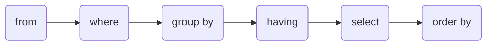

## 文件历史：

1. 2020年12月15日10:08:58 创建，以前看过的《SQL必知必会》和《SQL基础教程》，以这两本书为基础总结一下。在此之前使用了一年多的 MySQL，但没有做过相关总结。觉得应该记录一下，方便以后查看。

## 数据库基础

数据库 (database) 是的保存数据的物理位置。而 Oracle，MySQL，PostgreSQL 等这些数据库软件应该被称为数据库管理系统 (database management system, DBMS)。

### 常见的数据库类型

1. 层次数据库：数据通过树形结构表现，现在很少
2. 关系数据库：由行和列组成的二维表来管理数据；典型Oracle、SQL server、DB2、PostgreSQL、MySQL
3. 面向对象数据库：保存对象的数据库
4. XML数据库：可以对XML形式的大量数据进行高速处理
5. 键值储存系统：保存查询使用的主键和值的组合的数据库的

数据库结构常见的为 C/S 结构，即一个数据服务器可以被多个客户端访问。

### 关系型数据库基本结构

表是特定类型数据的结构化清单。数据库与表名的组合是唯一的，因此可以在不同数据库中有相同名字的表。

列存储了数据的分类信息，行是单位数据的一个基本单位。主键是行的唯一标识所在的列，因此同一张表中不会有相同主键，每行的主键不能为 null ，主键的值不能被修改，主键值不能被重复使用（删除某行后，主键值不能被用于新行）。

### SQL定义

SQL 全称 Structured Query Language。标准 SQL 由 ANSI 标准委员会管理，称为 ANSI SQL。所有主要 DBMS 都有自己的扩展。

SQL 主要分为以下几类：

#### Data Definition Language:数据定义语言

create 创建数据库和表

drop 删除数据库和表

alter 修改数据库和表

#### Data Manipulation Language:数据操纵语言

select 查询表中的数据

insert 向表中插入数据

update 更新表中的数据

delete 删除表中的数据

#### Date Control Langugae:数据控制语言

commit:确认对数据库中的数据进行的变更

rollback:取消对数据库中的数据进行的变更

grant:赋予用户操作权限

revoke:取消用户的操作权限

## 查询基础

```mysql
select <column> from <table>;-- <>表示会发生变化的对应位置名称 多条语句用分号分隔，总是加上分号没有坏处
select <column1>, <column2> from <table>;-- 多个列使用 , 隔开
select * from <table>;-- 使用通配符 * 搜索整张表，列的顺序一般是在表定义中出现的物理顺序。检索不需要的列会降低性能
select distinct <column1>, <column2> from <table>;-- 使用distinct则只返回不同的值，并且distinct必须作用于所有列不能单独作用于一列
select <column> from <table> limit <num> offset <start>;-- MySQL，PostgreSQL适用，限制输出的结果行数。行数下标从0开始
select <column> from <table> limti <start>,<num>;-- 同上功能的简写形式
-- "--"后跟一个空格才能使注释生效
# mysql中可使用"#"
/*
多行
注释
和Java
一样
*/
```

SQL语句一般返回原始的、无格式的数据。数据的格式化应当由显示该数据的应用程序来完成。

## 排序检索数据

```mysql
select * from <table> order by <colunm1> asc, <column2> desc;-- 对查询结果按照列排序，先按 column1 排序，相同情况再按 column2 排序
-- 默认按照升序 asc, 降序 desc 需要显式写出, 排序中有 null 会在开头或末尾显示
```

## 过滤数据

数据除了在数据库过滤还可以在应用层过滤，但是应用程序中过滤需要遍历返回的数据，花费时间 $O(n)$。会很影响程序性能。并且还会造成数据库和应用程序之间带宽的浪费。

```mysql
select * from <table> where <column> = <condition>;-- 使用where指定条件
-- 条件可以是 =, <>, !=, <, <=, >, >=, between, is null
select * from <table> where <column> between <condition1> and <condition2>;-- 使用 and 连接两个条件
select * from <table> where <column> is null;-- 过滤null 只能用is null 而不是 = null
select * from <table> where <column1> = <condition1> and <column2> = <condition2>;-- 两个条件取交集
select * from <table> where <column1> = <condition1> or <column2> = <condition2>;-- 两个条件取并集
select * from <table> where <column1> = <condition1> or <column2> = <condition2> and <column3> = <condition3>;-- 先计算and再计算or
select * from <table> where <column1> in (<condition1>,<condition2>);-- 条件取括号中的值之一
select * from <table> where <column1> not in (<condition1>,<condition2>);-- not 对筛选条件取补集
```

## 用通配符进行过滤

通配符只能用于文本字段，非文本数据类型字段不能使用通配符搜索

```mysql
select * from <table> where <column1> like 'text%';-- 用来筛选的行必须包含以'text'开头, %表示任何字符出现任意次数 单个%不会匹配null 
select * from <table> where <column1> like 'text_';-- 单个任意字符用_表示
select * from <table> where <column1> like 'text[AB]';-- []指定一个字符集, 它匹配指定位置的一个字符
select * from <table> where <column1> like 'text[^AB]';-- '^'排除掉[]中的字符
```

## 创建计算字段

计算字段并不存在于表中，是在运行 select 语句内创建的。

```mysql
select <column1> +'text' from <table>;-- 多数DBMS使用这种语法拼接字段和字符串 + 可以用 || 代替
select concat(<column1>, 'text') from <table>;-- MySQL和MariaDB使用这种语法
select concat(trim(<column1>) +'text') from <table>;-- trim()去掉字符串左右两边的空格, rtrim()和ltrim()分别取出右和左的空格
select <column1> + <column2> as <name> from <table>;-- 查询结果的表头字段为 name 即别名, 计算符号有 + - * /, null 与 任何值计算都是 null
```

## 使用函数处理数据

```mysql
select length(<column1>) from <table>;-- 返回字符串长度
select lower(<column1>) from <table>;-- 字符串转小写 upper()字符串转大写
select left(<column1>,<num>) from <table>;-- 返回从左开始指定长度字符串，right()返回右边开始指定长度的字符串
select abs(<column1>) from <table>;-- 求字段绝对值 exp()指数, sqrt()平方根
select replace(str1，str2，str3) from <table>;-- str1是要处理的字符串，str2是要被替换的部分，str3是用来替换的字符串
select case <column> 
when <option1> then <value1>
when <option2> then <value2>
when <option3> then <value3>
else null
end
from <table>;-- case when 类似于 switch case，但只是将值替换。默认会有else null
```

## 聚合函数

```mysql
select avg(<column1>) from <table>;-- 求平均值 sum()求和
select count(<column1>) from <table>;-- 对指定行计数 count(*)会统计 null, 指定列名会忽略该列为 null 的行
select max(<column1>) from <table>;-- 求最大值 min()求最小值
-- 如果在函数中加上distinct 则只统计不同的值
```

## 分组数据

```mysql
select <column1>, count(<column1>) from <table> group by <column1>;-- 根据指定字段的值分组, 聚集函数会对每个分组而不是整个结果集聚集
/*
除了聚集计算外，select 语句中的每一列都必须在 group by 子句中给出。分组列中包含有 null 的行，则将 null 将作为一个分组返回，有多行有 null 将被分为一组。大多数 SQL不允许 group by 列带有长度可变的数据类型。
*/
select <column1>, count(<column1>) from <table> group by <column1> having count(<column1>) = <condition1>;-- 分组后筛选要用having where只对行有过滤，排除的行不会在分组中
```

SQL 中以下关键只能按照顺序使用，select from where group by having order by

SQL 执行顺序如下



from 先指明从那张表查询，where 筛选出符合条件的行，group by 根据指定行分组，having 筛选出符合条件的组，order by 最后排序

## 子查询

```mysql
select * from <table1> where <column> in (<select>)；-- 通过一个select语句找出要查找条件，即使用了子查询。子查询只能返回单列
```

## 联结表

```mysql
select <table1.column1>, <table2.column2> from <table1>, <table2> where <table1.column3> = <table2.column4>;-- 一次查找出两张表中的数据，根据条件联结在一起，如果没有 where 筛选数据，则会返回笛卡尔积。检索出的行的数目是第一个表的行数乘以第二个表的行数
select <table1.column1>, <table2.column2> from <table1> inner join <table2> on <table1.column3> = <table2.column4>;-- inner join 内联结，使用 on 来指定两个表之间关联的条件 实际上一句也是内联结，使用where指定条件。内联结只展示两个表基于条件共有的部分
select <table1.column1>, <table2.column2> from <table1> left join <table2> on <table1.column3> = <table2.column4>;-- left 还可以是 right 外联结与内联结的主要区别在于以其中一个表为基准，没有匹配的行也要展示出来 left以左边的表为基准，right同理 
-- coalesce( colunm, xxx)将null转换为xxx改变外部连接结果中的null时是唯一选择
```

一个联结可以包含多个表，应该在一起测试的之前，分别测试每个联结，更容易排除故障

## 组合查询

```mysql
select <column1> from <table1>
union
select <column2> from <table2>;
/*
多个查询使用union连接 union将两个查询取并集，会去重，列数量必须相同，相同的列数据类型必须相同，保留重复使用 union all
 intersect 取两个查询的交集，保留重复使用 intersect all
 except 表1 减去 表2 部分
 表之间的除法？？？？？？？？？
*/
```

union 必须由两条或两条以上的 select 语句组成，语句之间用 union 分隔。union 中的每个查询必须包含相同的列、表达式或是聚集函数。

## 插入数据

```mysql
insert into <table> values (<value1>,<value2>,<value3>...);
insert into <table>(<column1>,<column2>,<column3>...) values (<value1>,<value2>,<value3>...);-- 使用下面的格式更安全，表名后的括号给出了详细列名，并且不依赖列的顺序
-- 被省略的列，要么允许为 null，要么设定了默认值。要使用默认值最好显式的写出 default
insert into <table1>(<column1>,<column2>,<column3>...) select <column1>,<column2>,<column3> from <table2>;-- 将检索出的数据插入到另一张表中 可以用 where, group by等筛选
create table <table1> as select * from <table2>;-- 将一个表中的数据复制到一张新表中
```

## 更新和删除数据

```mysql
update <table> set <column1> = <value1>, <column2> = <value2> where <column2> = <condition>;-- where 条件必须要有不然会对整张表进行更新
delete from <table> where <colunm> = <condition>;-- 删除语句也要加上条件不然会删除所有数据
truncate <table>;-- 清空表数据，比delete更快，因为不用记录数据变动
/*
在update和delete使用where之前应该select保证过滤的是正确的记录
*/
```

## 创建和操纵表

```mysql
create table <table>(
<column1>	char(10)	not null,
<column2>	decimal(10.2)	not null,
<colnum3>	varchar(100)	null	default ‘’
);-- 列名	数据类型 能否为null 默认值
alter table <table> add <column> char(10) null;-- 为表添加列
alter table <talbe> rename <newname>;-- 重命名表
drop table <table>;-- 删除表
/*
create table if not exists <table> 如果不存在表则创建
drop table if exists <table> 如果存在表则删除
*/
```

## 视图

```mysql
create view <view> as select <colunm>, <column> from <table>,<table> where <column> = <condition>;-- 以查询结果创建一个虚拟表，即视图
drop view <view>;-- 删除视图，更新视图需要先删除然后再重新创建
```

视图不包含数据，所以每次处理查询执行时都必须处理查询执行时需要的所有检索。如果用多个联结和过滤创建了复杂的视图或者嵌套了视图，性能可能会下降得厉害。视图不能索引也不能有关联的触发器和默认值

视图在源数据表更新时会被更新，本质是select语句，视图满足下列条件时能被更新

1. 未使用distinct
2. from只有一张表
3. 未使用group by 或者 having
4. 列为原始数据列未进行计算

## 管理事务处理

在 MySQL 中只有使用了 Innodb 数据库引擎的数据库或表才支持事务。事务管理可以用来管理 insert、update、delete 语句。不能回退 select 语句，也没有必要回退 select。也不能回退 create 或 drop 操作。事务处理可以使用这些语句，回退时这些操作也不撤销。

事务的 ACID 特性：

原子性 ( **A**tomicity )：全部执行或全部不执行

一致性 ( **C**onsistency ) ：事务中处理要满足约束

隔离性 ( **I**solation )：不同事务间互不干扰，某个事务进行中的更改，对于其他事务是不可见的

持久性 ( **D**urability )：事务提交后，数据会被持久保存

```mysql
start transaction;-- 开始事务
...
commit transaction;-- 提交事务 这两句语句之间的 SQL 必须完全执行或者完全不执行
savepoint <savepoint>;-- 创建保留点
rollback to <savepoint>;-- 回退事务到保留点
set transaction isolation level <level>;-- 设置事务的隔离级别 有read uncommitted/read committed/repeatable read/serializable 四种等级
/*
read uncommitted 隔离级别最低，事务会读到另个一个事务更新但未提交的数据，如果另一个事务回滚则当前事务读到的就是脏事务
read committed 可能会遇到不可重复读问题。在一个事务内，多次读同一数据，这个事务还没结束，另一事务修改了这个数据并提交，当前事务两次独到的数据可能不一致
repeatable read 可能会遇到幻读。在当前事务中第一次查询某记录发现没有。但更新这条不存在的记录成功，再次查询时不存在的数据出现了，读到了另一事务插入的数据。
serializable 最严格的隔离级别 不会碰到脏读、不可重读、幻读。但事务是串行执行，性能会急剧降低。没有特别重要的场景，一般不用Serializable
mysql中使用 InnoDB，默认隔离级别是 repeatable read
*/
```

## 主键

- 任意两行主键值不同
- 每行都有一个主键值
- 包含主键值的列从不修改或更新
- 主键值不会重用，如果从表中删除某一行，其主键值不分配给新行

## 外键

用来保证引用其他表数据的正确性，防止意外删除。

## 索引

索引改善检索的性能，但降低了数据插入、修改和删除的性能。执行这些操作时 DBMS 必须动态地更新索引。

索引用于数据过滤和数据排序。如果常以某种特定顺序排序数据，以该列作为索引较适合。

```mysql
create index <index> on <table> (<column>,...)
```

## 存储过程

以后要用到了再看

## 触发器

触发器是特殊的存储过程

## 窗口函数

